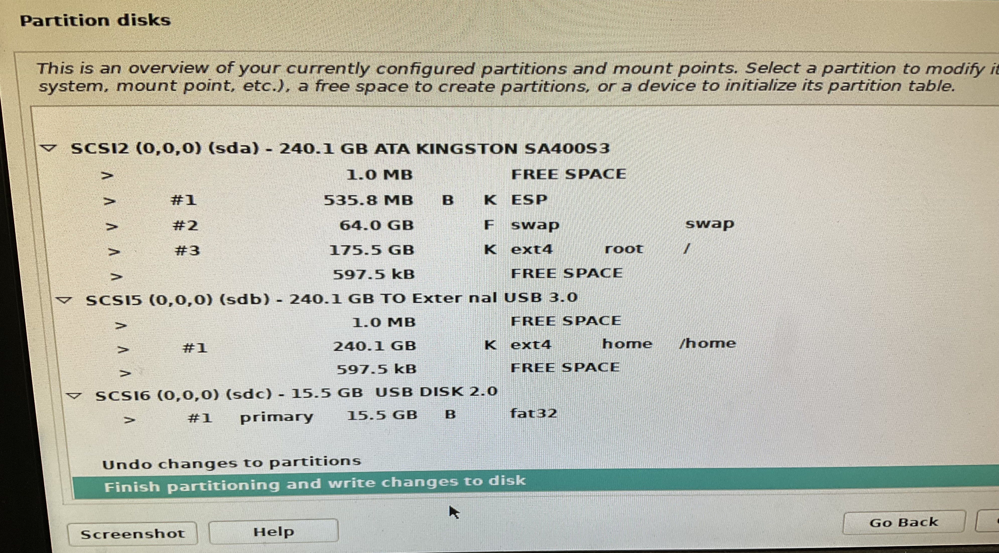

# Class Server Setup


Setup instructions for Debian server for high school classroom.

## Loading Debian

- my setup has 2 drives:
  - 1 for OS
  - 1 for /home directories

- setup hard drives and partions as follows:
  - ensure you have a "LARGE" swap file
  - DO NOT load any software (web server, SSH, ...), only a GUI (if you want)


## After OS Loading Setup

- after the server is up and running install the following, logged in as "root"!
  - update server packages
    - ```sh
      apt update && upgrade -y
      apt install git -y
      ```
  - change ttyd font size
    - ```sh
      dpkg-reconfigure console-setup
      ```
- run the following setup script
  - ```sh
    cd /tmp
    git clone git@github.com:Mr-Coxall/Class-Server-Setup.git
    ./Class-Server-Setup/setup.sh
    ```
  - allow root to login to GUI (if you installed one!):
    - ```sh
      nano /etc/pam.d/gdm-password
      auth required pam_succeed_if.so user != root quiet
      ```
  - now test apache2 & PHP installation
    - ```sh
      goto: http://your-server-ip/info.php
      ```
  - set a static IP address for the server
    - /etc/network/interfaces
      - ```sh
        allow-hotplug enp1s0
        iface enp1s0 inet static
          address 172.22.52.80
          netmask 255.255.255.0
          gateway 172.22.52.1
          dns-nameervers 8.8.8.8 8.8.4.4
        ```
- install cron to reboot daily
  - sudo crontab -e
  - ```sh
    0 4   *   *   *    /sbin/shutdown -r +5
    ```
## How to add a user
  - ```sh
    sudo adduser --ingroup ICD2O --shell /bin/fish --allow-bad-names -comment "First Last" first2.last2
    ```
  - ```sh
    sudo adduser --ingroup ICS4U --shell /bin/bash --allow-bad-names -comment "First Last" first.last
    ```
  - run this after adding a user, so that their home page works
    - ```sh
      sudo chmod 711 ~/first.last
      ```
# How to delete a user
  - ```sh
  sudo deluser --remove-all-files zishuo.zhuang
  ```